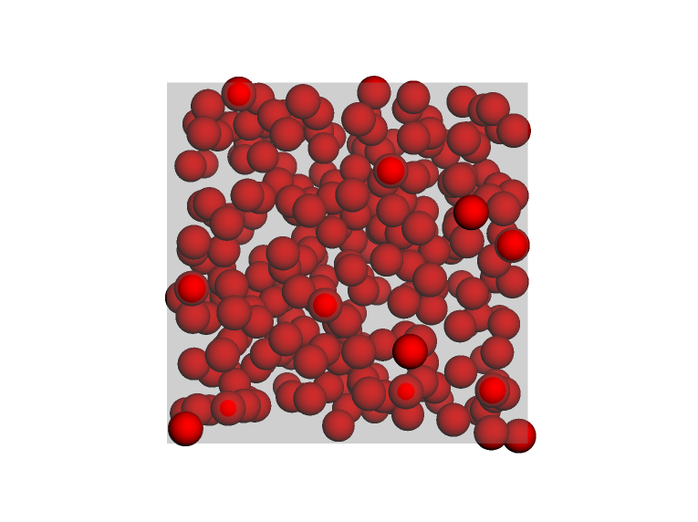

:::::::::::::::::::::::::::::::::::::: questions 

- How can I turn on hoomd and run a simulation?

::::::::::::::::::::::::::::::::::::::::::::::::


::::::::::::::::::::::::::::::::::::: objectives

- Turn on the simulation software
- Use an initial configuration
- Define interaction rules and the simulation ensemble (NVT)
- Set initial velocities
- Execute 10000 steps
- Visualize the last snapshot

::::::::::::::::::::::::::::::::::::::::::::::::

## Introduction


This week we'll be building up your understanding of molecular simulation techniques, starting with MD simulations and moving to MC simulations. 

As we do, we'll be *fading in* more complexity. 


At it's core, running a molecular simulation consists of 5 parts:

1. "Turning on" the simulation software
1. Creating an initial configuration 
1. Define the rules of our model
1. Performing a number of "steps" forward in time
1. Analyzing the simulation data

These steps are not always performed sequentially, but they're always there.

In our first simulation example we're going to:

1. Turn on hoomd-blue, a simulation engine that works nicely in python
1. Load in a configuration of randomly-packed spheres that has been created for us
1. Define Lennard-Jones interaction rules and an NVT ensemble
    1. Bonus: We're going to set the initial velocities, too
1. Step forward 10000 steps.
1. Visualize the last snapshot.


### Getting Started

First off, we need to grab the HOOMD-blue python package, then we'll "turn on" HOOMD
 by telling it where we want it to run, i.e. on the CPU. For our first example, we're going
 to load a pre-made system instead of building it up from scratch, so we can familiarize
 ourselves with the steps to launch a simulation.

```python
import hoomd

# Attach to CPU and create simulation
cpu = hoomd.device.CPU()
sim = hoomd.Simulation(device=cpu, seed=0)
sim.create_state_from_gsd(filename='random.gsd') # N and V are set here
```
### Defining the Rules of Our model

Now that we've got a system loaded in, we need to tell HOOMD how we want that system to behave.
We do this by creating a _potential_ that acts on a _neighbor list_ of particles,
defining the potential energy of interactions between each pair of particles therein.
Finally, we feed these rules to an _integrator_, which uses our energy functions 
to calculate forces for each particle, and then propagate their motion at each step
forward in time. The `dt` argument to the integrator tells it how large of a step to 
take each iteration. We also need to select one of a few integration methods, based on
which thermodynamic ensemble we want to draw samples from, i.e., which thermodynamic
variables are fixed. In this example, we will hold N, V, and T constant (the Canonical ensemble).
Once that's all set up, we kick off motion by randomizing the initial particle velocities and
we're ready to go!

```python
# Potential energy function setup
cell = hoomd.md.nlist.Cell(buffer = 0.4)
lj_potential = hoomd.md.pair.LJ(nlist=cell)
lj_potential.params[('A','A')] = dict(epsilon=1,sigma=1)
lj_potential.r_cut[('A','A')]=2.5

# Integrator setup
integrator = hoomd.md.Integrator(dt=0.005)
nvt = hoomd.md.methods.NVT(kT=1.5,filter=hoomd.filter.All(),tau=1.)
# Now we tell the integrator about the forces and how to use them
integrator.forces.append(lj_potential)
integrator.methods.append(nvt)
# Give the integrator to our simulation
sim.operations.integrator = integrator

# Finally, we start our particles moving at random velocities
sim.state.thermalize_particle_momenta(filter=hoomd.filter.All(), kT=1.5)
```

### Running the Simulation

Now that we've set up all the pieces, all that's left is to run the simulation!

```python
# Run the simulation for 10,000 steps
sim.run(1e4)
```

### Visualizing the Outcome

Once we're done running our simulation, we can look at the final configuration.

```python
import mbuild
hoomd.write.GSD.write(state=sim.state, filename='final.gsd', mode='wb')
final = mbuild.load('final.gsd')

view = final.visualize()
view.setStyle({'sphere': {'scale': 3., 'colorscheme': {'A': 'red'}}})
view.addBox({'center': {'x': 0, 'y': 0, 'z': 0},
             'dimensions': {'w': 10 * final.box.Lx, 'h': 10 * final.box.Ly, 'd': 10 * final.box.Lz},
             'color': 'gray',
             'opacity': 0.6}
            )
```

{alt="Final frame
 of a Lennard-Jones simulation, showing particles in a simulation box."}

::::::::::::::::::::::::::::::::::::: keypoints 

- hoomd can run simulations entirely within a python interface

::::::::::::::::::::::::::::::::::::::::::::::::

